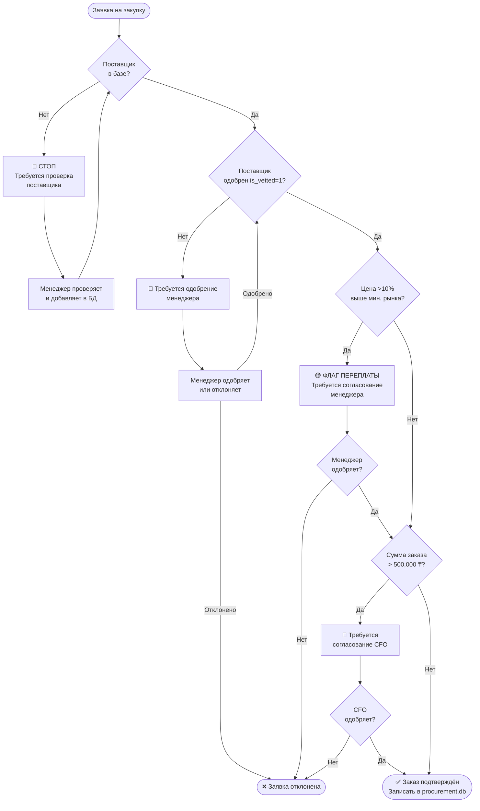

# Procurement Approval Decision Tree

## Правила кратко

| Условие | Действие | Кто согласует |
|---------|----------|---------------|
| Новый поставщик (нет в БД) | Блокировать | Менеджер добавляет и проверяет |
| Поставщик не одобрен | Блокировать | Менеджер |
| Цена > рынок + 10% | Флаг + пауза | Менеджер |
| Сумма > 500,000 ₸ | Флаг + пауза | CFO |
| Всё в норме | Авто-подтверждение | — |
